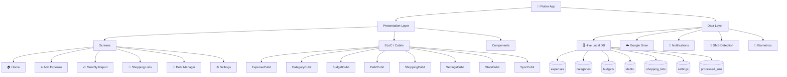
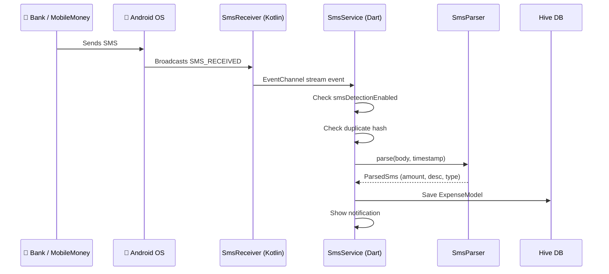

# 📱 Expense Tracker Offline

> A powerful, secure, and offline-first personal finance application for Android. Track expenses and income, manage debts, organize shopping lists, and now automatically detect transactions from SMS — all without an internet connection.

---

## 🗺️ App Architecture

---

## 🚀 Features

### 📊 Expense & Income Tracking
- **Quick Add**: Add expenses or income with amount, category, date, and note.
- **Categorization**: Organize spending with customizable categories and icons.
- **Shortcuts**: One-tap shortcuts for frequent expenses directly from the home menu.
- **Transaction History**: Browse, search, filter, edit, and delete all past transactions.
- **Recurring Transactions**: Set up **Weekly** or **Monthly** repeating transactions that auto-generate on schedule.

---

### 💰 Budgeting
- **Monthly Budgets**: Set spending limits per category or overall monthly spend.
- **Visual Progress**: Dynamic progress bars on the dashboard show remaining budget in real time.
- **Budget Alerts**: Visual cues warn when you're approaching or exceeding limits.

---

### 📈 Reports & Analytics
- **Multi-Period View**: Switch between **Weekly**, **Monthly**, and **Yearly** views.
- **Interactive Bar Charts**: Visualize income vs. expenses over time.
- **Category Pie Charts**: See spending distribution by category at a glance.
- **Category Drill-Down**: Tap any category to view its individual transactions.
- **PDF & CSV Export**: Export financial history to PDF or CSV for records or external analysis.

---

### 🛒 Shopping Lists
- **Multiple Lists**: Create and manage separate lists (e.g., Groceries, Electronics).
- **Item Costs**: Add estimated costs per item and track the running total.
- **Completion Tracking**: Check off items as you shop with progress bars.
- **Edit & Rename**: Update list names, item names, and costs at any time.
- **Swipe to Delete**: Quickly remove lists or items you no longer need.

---

### 🤝 Debt & Lending Manager
- **Lent / Borrowed**: Track money you've given out or owe to others.
- **Per-Person History**: View a full transaction timeline per contact.
- **Due Dates**: Set optional due dates for reminder awareness.
- **Mark as Paid**: Toggle debts as settled while preserving the history.
- **Balance Summary**: See outstanding balances per person at a glance.

---

### 📲 SMS Transaction Detection *(Android Only)*
Automatically detect financial transactions from bank SMS messages and create expense/income entries without manual input.

**Supported Services:**

| Service | Pattern Detected | Type |
|---|---|---|
| **CBE** | `Credited with ETB X from [Name]` | ✅ Income |
| **CBE** | `transfered ETB X to [Name]` | 💸 Expense |
| **Telebirr** | `transferred ETB X to [Name]` | 💸 Expense |
| **MPesa** | `purchased [Item] @X ETB` | 💸 Expense |

**How it works:**

- **Duplicate Protection**: Each SMS is hashed (SHA-256) so the same message is never added twice.
- **Enable/Disable**: Toggle in **Settings → Notifications → SMS Transaction Detection**.
- **Permissions Required**: `READ_SMS`, `RECEIVE_SMS` (prompted on first enable).

---

### 🔒 Privacy, Security & Sync
- **Offline First**: All data stored locally on the device — no account needed.
- **App Lock**: Protect your data with biometric (fingerprint/face) or PIN authentication.
- **Google Drive Backup**: Sync your database to your personal Google Drive account.
- **Restore from Cloud**: Restore data from Google Drive without overwriting existing records.
- **Local Backup & Restore**: Export and import your Hive database as a local file.

---

### 🎨 Modern UI & Experience
- **Dark Mode**: Fully supported system-aware dark theme.
- **Smooth Animations**: Fluid page transitions and micro-interactions throughout.
- **Premium Design**: Clean card-based layout with the Inter typeface.
- **Daily Reminder Notifications**: Get reminded to log expenses at a time you choose.

---

## 🛠️ Technology Stack

| Layer | Technology |
|---|---|
| Framework | Flutter (Android-first) |
| State Management | BLoC / Cubit |
| Local Database | Hive (NoSQL) |
| Cloud | Google Drive API + Firebase |
| SMS Bridge | Native Kotlin EventChannel |
| Notifications | flutter_local_notifications |
| Security | local_auth (biometrics) |
| Charts | fl_chart |
| Fonts | Google Fonts — Inter |
| Hashing | crypto (SHA-256) |

---

## 📱 Getting Started

1. **Install**: Build and install the APK on your Android device.
2. **Secure**: Enable **App Lock** in Settings for biometric protection.
3. **Track**: Tap the `+` button to add your first expense or income.
4. **Automate**: Go to **Settings → Notifications** and enable **SMS Transaction Detection** to let the app do the work.
5. **Analyze**: Open **Reports** to review your spending patterns.
6. **Backup**: Enable **Google Drive Sync** in Settings to keep your data safe.

---

*Take control of your finances — automatically.*
