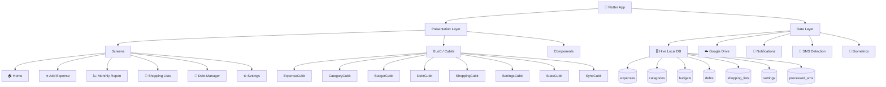

# 📱 Expense Tracker Offline

> A powerful, secure, and offline-first personal finance application for Android. Track expenses and income, manage debts, organize shopping lists, and automatically detect transactions from SMS — all without an internet connection.

---

## 🗺️ App Architecture



---

## 🚀 Key Features

### 📊 Expense & Income Tracking
- **Quick Add**: Seamlessly log expenses or income with amount, category, date, and notes.
- **Categorization**: Use the built-in category management system with over 50 custom icons.
- **One-Tap Shortcuts**: Create shortcuts for your most frequent transactions for even faster logging.
- **Batch History**: A powerful history view with search, filtering, and editing capabilities.
- **Recurring Transactions**: Set up scheduled expenses (Weekly/Monthly) that automatically populate in your ledger.

### 💰 Smart Budgeting
- **Granular Controls**: Set monthly spending limits globally or per category.
- **Live Monitoring**: Dashboard widgets provide real-time feedback on your remaining budget.
- **Visual Cues**: Color-coded progress bars change from green to red as you approach your limits.

### 📈 Advanced Analytics
- **Dynamic Charting**: Interactive bar and pie charts visualize your financial health across different time periods.
- **Period Comparison**: Automatically compare your current spending with previous weeks or months.
- **Drill-Down Capability**: Tap into any report segment to see the exact transactions making up that total.
- **Pro Exports**: Generate detailed **PDF reports** or **CSV data dumps** for professional use.

### 🤝 Debt & Relationship Manager
- **Bilateral Tracking**: Keep track of money lent to or borrowed from individuals.
- **Transaction Timelines**: View a full history of transactions for every contact.
- **Settlement Tracking**: Easily mark debts as settled while maintaining a permanent record.

### 🛒 Integrated Shopping Lists
- **Cost Estimation**: Estimate prices for list items to see a projected total before you reach the store.
- **Project Tracking**: Manage multiple lists simultaneously with progress indicators.

---

## 📲 Smart Features

### 📡 SMS Transaction Detection *(Android only)*
The app can automatically parse bank SMS messages to log transactions instantly.
- **Privacy First**: All parsing happens locally on your device. No data is sent to external servers.
- **Duplicate Prevention**: Content-based hashing ensures that even if you receive multiple alerts, only one transaction is logged.
- **Extensible Parsers**: Currently supports CBE, Telebirr, and MPesa patterns.

### 🔐 Security & Backup
- **Biometric Protection**: Lock the app behind Fingerprint or Face IDs using `local_auth`.
- **Google Drive Sync**: Securely back up your Hive database to your own Google Drive storage.
- **Local JSON Backup**: Export your entire database to a human-readable JSON file for manual archiving.
- **Smart Merge**: Restore backups without deleting your current data — the app intelligently merges records.

---

## 🎨 Design Philosophy
- **Modern Aesthetics**: Built with a sleek, premium dark-mode-first design.
- **Custom Branding**: Features a unique, professional app icon and a coordinated splash screen.
- **Micro-Interactions**: Subtle animations and transitions make the app feel alive and responsive.
- **Typography**: Uses the **Inter** font family for maximum readability.

---

## 🛠️ Technology Stack

| Component | Technology |
|---|---|
| Framework | **Flutter** (Dart) |
| State Management | **BLoC / Cubit** |
| Local Database | **Hive (NoSQL)** |
| Cloud Services | **Google APIs** |
| Native Bridge | **Kotlin** (for SMS EventChannels) |
| Formatting | **Intl** (Currency/Dates) |
| Icons | **Lucide Icons** |
| Security | **AES Encryption (proposed)** / Biometrics |

---

## 🏗️ Building the App

To build a professional, optimized release version of the app, use the following commands:

### Standard Build
```bash
flutter build apk --release
```

### Optimized Split Build (Recommended)
This command splits the APK per architecture, reducing the download size for users:
```bash
flutter build apk --split-per-abi --no-tree-shake-icons
```

> [!NOTE]
> The `--no-tree-shake-icons` flag is required because the app uses dynamic IconData for user-selected category icons.

---

*Take control of your financial future — one tap at a time.*
